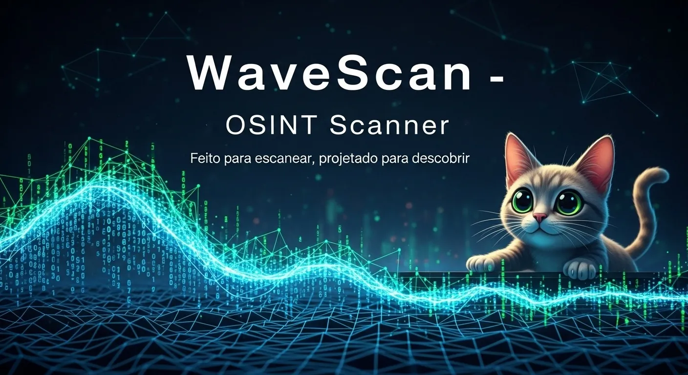

# WaveScan 🌊🔍

Readme: [English](README.md)




O **WaveScan** é um scanner de segurança web abrangente projetado para administradores, desenvolvedores e profissionais de segurança realizarem avaliações de vulnerabilidade completas. Ele oferece desde varreduras básicas de portas até análises avançadas de código-fonte e vulnerabilidades, garantindo a integridade de aplicações web.

## ✨ Funcionalidades Detalhadas
O WaveScan consolidada uma vasta gama de módulos especializados:

### 🛡️ Inteligência e Reconhecimento

- **Multi-Idioma**: Suporte nativo para pt-BR, Inglês e Espanhol.
- **Curl Impersonate**: Utiliza o `curl-impersonate` para realizar requisições idênticas a navegadores reais, contornando detecções simples.
- **Technology Fingerprinting**: Wrapper customizado do `WhatWeb` com User-Agents modernos para detectar CMS (WordPress), bibliotecas, analytics e servidores, salvando resultados limpos e sem códigos ANSI.
- **Detecção de Firewall & WAF**: Identifica `firewalls` de aplicação web, `proteções DDoS` e sistemas de prevenção de intrusão através de `análise de tráfego`.

### 🔍 Auditoria de Superfície e Conteúdo

- **Port Scanning**: Varredura de portas `TCP/UDP`, `banners de serviços` e identificação de `versões de software` no host alvo.
- **Iframe Checker**: Extrai `fontes de iframes` (incluindo caminhos relativos e arquivos `.php`) usando `User-Agents realistas`. Permite seleção manual se múltiplos iframes forem detectados.
- **Análise de CSS e Caminhos**: Varre arquivos CSS em busca de referências `url(...)`, reconstruindo caminhos para descobrir diretórios ocultos (ex: `/assets/`, `/uploads/`).
- **HTTP Method Check**: Simula o Googlebot para testar métodos HTTP via requisição `OPTIONS`, capturando cabeçalhos de permissão (`Allow`).

### 🚀 Escaneamento de Vulnerabilidades (Active Scanning)
- **Enumeração de Diretórios**: Utiliza `gobuster` com wordlists do `SecLists` para localizar diretórios e arquivos, filtrando códigos de status (`200`, `301`, `403`).
- **Busca de Arquivos Sensíveis**: Varredura focada em arquivos expostos como `.zip`, `.sql`, `.env`, `.bak` e `.log`, com filtragem de falsos positivos por tamanho de resposta.
- **Fuzzing de Parâmetros PHP**: Coleta URLs e utiliza `wfuzz` para testar parâmetros em busca de exposição de código (ex: `<?php`) e Path Traversal (`../`).
- **Vulnerability Probing**: Testes automatizados para `SQLi`, `XSS` e `Open Redirects` analisando as respostas do servidor.
- **FTP/SSH Checker**: Verifica portas `21` e `22`, captura banners com `netcat`, testa autenticação anônima e realiza probes com `hydra` para validar o hardening do servidor.
- **Index Check**: Utiliza `FFUF` para identificar páginas de `"Index of"` e arquivos de backup remanescentes.

📊 Relatórios e Saída
- **Sumário Multi-formato**: Converte os achados em relatórios organizados em PDF, TXT e PNG (imagem).
- **Gerenciamento de Wordlists**: Configuração automática do SecLists, dirb e criação de listas customizadas para debug.

## Requerimentos

- **SO**: Linux/Unix-based systems (utilizado no Ubuntu).
- **Dependências**:
  - `curl`
  - `sed`
  - `grep`
  - `awk`
  - `bash`
  - Outras utilidades padrão do Unix.

## 🚀 Instalação e Uso

1. **Clonar o repositório**:
    ```bash
    git clone https://github.com/percioandrade/wavescan.git
    cd wavescan && chmod +x wavescan
    ```
    
2. **Instalar dependências**:
- Certifique-se de que as ferramentas necessárias (como `curl`, `grep`, `sed`, etc.) estejam instaladas em seu sistema. Você pode instalá-las usando o gerenciador de pacotes.

*O parâmetro -i instala todas as dependências e configura as Wordlists*

## Exemplos de Execução

- **Scan Completo**: ./wave.sh seu-alvo.com]
- **Modo Rápido (Wordlists menores)**: ./wave.sh seu-alvo.com -f
- **Modo Dev (Wordlist de debug)**: ./wave.sh seu-alvo.com -d

⚙️ Configuração

Ajuste os módulos ativos e o idioma no arquivo config.sh:

- **__FUNC_ADVANCED_SCAN**(true/false): Habilita o scan avançado, mais demorado.
- **__FUNC_NORMAL_SCAN**(true/false): Habilita o scan básico, mais rapido.
- **__FUNC_NORMAL_SCAN=**(true/false): Desabilita o scan. 
- **LANGUAGE=**"pt-BR": Altera o ídioma, códigos de idioma podem ser visualizados no diretorio `lang`

## ⚠️ Disclaimer

> [!WARNING]
> Este software é fornecido "tal como está". Certifique-se sempre de ter permissão explícita antes de analisar qualquer alvo. O autor não se responsabiliza por qualquer uso indevido, consequências legais ou impacto nos dados causados ​​por esta ferramenta.

## 📚 Detailed Tutorial

Para um guia completo, passo a passo, sobre como importar os arquivos gerados para o Thunderbird e solucionar problemas comuns de migração, confira meu artigo completo:

👉 [**Make a full OSINT with WaveScan**](https://perciocastelo.com.br/blog/make-a-full-osint-with-wavescan.html)

## 🤝 Créditos
Desenvolvido com base nos conceitos de Pentest da [DESEC Academy](https://academy.desecsecurity.com/introducao-pentest/)

## Licença 📄

Este projeto está licenciado sob a **GNU General Public License v3.0**. Consulte o arquivo [LICENSE](LICENSE) para mais detalhes.
